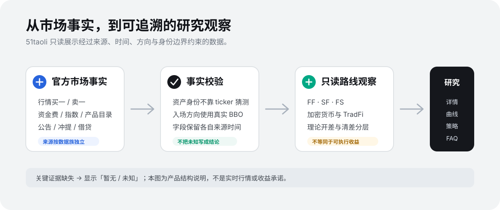

# 51taoli

> **全市场套利信息平台**  
> 跨平台、跨品种、全市场套利信息平台

  

51taoli 是一个**只读的跨市场套利情报平台**：将官方或经验证的只读市场事实，整理为有来源、有时间、有身份边界的市场观察，帮助用户研究价差、资金费、指数及相关市场条件。

> **先说清楚：**理论价差不是可成交收益；关键证据不足时，51taoli 显示「暂无」，不会补一个看似合理的数字。

## 从这里开始

| 你想解决的问题 | 建议阅读 |
| --- | --- |
| 51taoli 是什么、范围是什么、明确不做什么 | [产品介绍](docs/PRODUCT.md) |
| 我第一次应该怎样看一条机会 | [研究路径](docs/USE-51TAOLI.md) |
| FF / SF / FS、开差、清差、资金费、指数分别是什么 | [核心概念](docs/CONCEPTS.md) |
| 官网各个页面分别用来做什么 | [产品页面地图](docs/PRODUCT-MAP.md) |
| 为什么数据可信、为何会显示「暂无」 | [数据原则](docs/DATA-PRINCIPLES.md) |
| 常见使用、策略、账号与社群问题 | [常见问题（FAQ）](docs/FAQ.md) |

## 51taoli 提供什么

| 产品层 | 你能看到什么 | 关键边界 |
| --- | --- | --- |
| **套利机会** | FF / SF / FS 的方向性理论开差、清差、两腿市场事实 | 理论开差不等于可执行收益。 |
| **市场上下文** | 原始周期资金费、标记价、指数价、原生溢价、来源时间 | 不同字段独立更新，不能互相推导。 |
| **跨市场观察** | 加密货币与 TradFi 的筛选、产品目录和理论路线 | 同名 ticker 不自动视为同一资产。 |
| **辅助情报** | 公告、充提、借贷的已验证事实 | 每个数据族按各交易所官方能力独立开放。 |
| **策略研究** | 带版本、状态、短规则、真实机会和历史摘要的精选策略 | 策略不是交易授权，也不是收益承诺。 |

## 当前只读行情范围

| Binance | OKX | Bybit | Bitget | Gate | Hyperliquid | Aster |
| :---: | :---: | :---: | :---: | :---: | :---: | :---: |
| ✅ | ✅ | ✅ | ✅ | ✅ | ✅ | ✅ |

“七所”是当前只读行情范围，**不是**全部交易对、全部数据族或任何时刻都可用。实际数据覆盖请以官网当时的来源状态和页面状态为准。

## 三条读数纪律

1. **先确认事实**：使用真实方向性买一/卖一，不把中间价、标记价或最后成交价当作入场价；
2. **再判断证据**：资产身份、字段时间、产品单位、深度、实际费率、退出与借币条件分别核对；
3. **最后形成结论**：证据不足时保持「暂无 / 未知」，不补零、不插值、不伪造历史，也不把理论差价称为净收益。

  

## 当前不提供什么

51taoli 当前不提供：

- 自动下单、跟单、代客交易或资产托管；
- 用户交易所账户连接、余额/仓位读取、资金划转或提现；
- “无风险”“保证收益”“一键套利”等承诺；
- 用模拟行情、插值、零值或虚构路线填满页面。

价格差、资金费和历史表现仍可能受到深度、实际费率、滑点、借贷、额度、产品规则和市场变化影响，需要用户独立判断。

## 官方入口

| 官网 | 社群 | 公告 | 机器人 |
| --- | --- | --- | --- |
| [51taoli.com](https://51taoli.com) | [@taoli51](https://t.me/taoli51) | [@news_51taoli](https://t.me/news_51taoli) | [@taoli51_bot](https://t.me/taoli51_bot) |

Telegram 机器人用于社群答疑、规则、状态与公告支持。它默认只处理明确命令，不读取或保存普通群聊消息；策略的用户接收渠道与社群机器人是两套独立能力，具体开放状态以官网账户页为准。

## 这个公开仓库的作用

这里是 51taoli 的**公开说明中心**，用于发布项目介绍、概念解释、FAQ、经核验的公开公告以及问题反馈规范。

这里不发布生产源码、运行配置、访问凭证、用户数据或内部运维资料。文档解释产品规则，**不替代**实时接口、网页数据状态或生产验证结果。

## 反馈问题

欢迎通过 [GitHub Issues](https://github.com/yangshu2087/51taoli/issues) 或官方社群反馈。数据问题请尽量包含资产、交易所、页面链接/已脱敏截图、发生时间与时区、复现步骤；请先删除所有账户、订单、地址、密码、私钥、API Key、验证码和 Token。

安全相关事项请先阅读 [SECURITY.md](SECURITY.md)。
