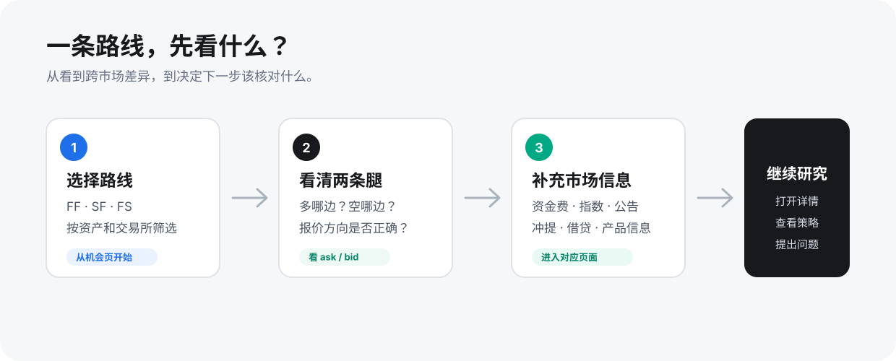
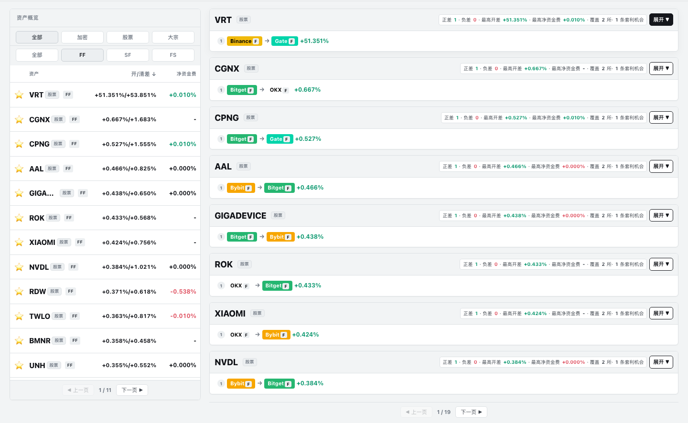

# 51taoli

> **把跨市场信息放在一条清楚的研究路径里。**

[**打开 51taoli 官网 →**](https://51taoli.com/opportunities)　[**加入官方社群 →**](https://t.me/taoli51)　[**查看公告 →**](https://t.me/news_51taoli)　[**询问机器人 →**](https://t.me/taoli51_bot)

51taoli 聚合不同交易所和市场里的报价、资金费、指数和辅助信息，帮助你找到路线、看清两条腿，并继续核对与自己有关的市场条件。

## 你可以用它做什么

- 找到 FF、SF、FS 三类跨市场路线；
- 看清多腿、空腿、报价方向、开差和资金费；
- 按资产、交易所、市场类型筛选，并进入交易、资金费、指数、公告、冲提、借贷或策略页面继续研究。

## 从哪里开始

1. [打开“套利机会”页](https://51taoli.com/opportunities)，挑一条路线；
2. 先看多腿、空腿和报价方向；
3. 再查看资金费、产品身份、深度、费用、退出或借贷等信息。

想按图了解界面，可以阅读 [界面导览](docs/INTERFACE.md)；第一次使用可阅读 [使用路径](docs/USE-51TAOLI.md)。

## 资料导航

| 想了解什么 | 直接阅读 |
| --- | --- |
| 51taoli 的定位和适用场景 | [产品介绍](docs/PRODUCT.md) |
| 页面里的图表和区域怎么看 | [界面导览](docs/INTERFACE.md) |
| FF、SF、FS、开差和清差 | [核心概念](docs/CONCEPTS.md) |
| 官网每个入口该看什么 | [产品页面地图](docs/PRODUCT-MAP.md) |
| 怎样理解时间、身份和「暂无」 | [数据说明](docs/DATA-PRINCIPLES.md) |
| 登录、策略、机器人与反馈 | [常见问题](docs/FAQ.md) |

## 当前覆盖

Binance、OKX、Bybit、Bitget、Gate、Hyperliquid、Aster。

覆盖范围会随市场、产品和数据状态变化；请以官网当时显示为准。

## 官方支持

- 官网：[51taoli.com](https://51taoli.com/opportunities)
- 社群：[@taoli51](https://t.me/taoli51)
- 公告：[@news_51taoli](https://t.me/news_51taoli)
- 机器人：[@taoli51_bot](https://t.me/taoli51_bot)
- 反馈：[提交 GitHub Issue](https://github.com/yangshu2087/51taoli/issues/new/choose)

安全问题见 [SECURITY.md](SECURITY.md)。
