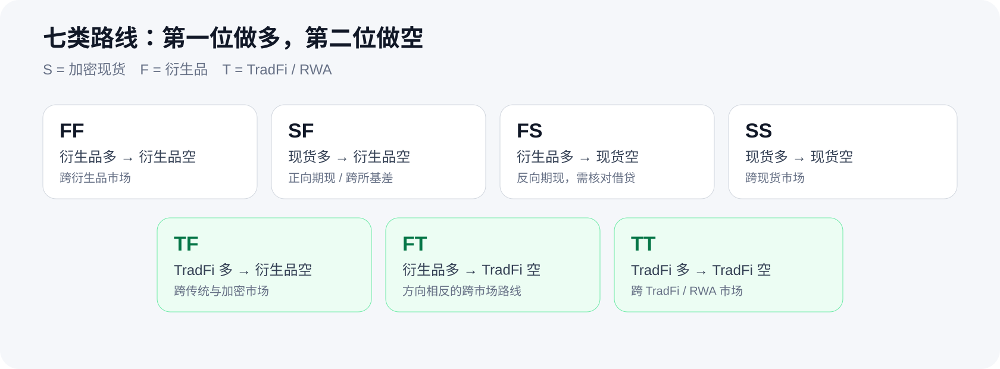

# 核心概念：先知道页面在说什么

<p align="center">
  
</p>

看到一条机会，先别急着问“能赚多少”。先分清：这是哪两种市场、开差是怎么来的、哪些成本还没算进去。

[**带着这些概念去看官网 →**](https://51taoli.com/opportunities)　[**看看界面里它们出现在哪里 →**](SCREENSHOTS.md)

## FF、SF、FS：三种路线，不是三种策略

| 类型 | 人话解释 | 还要盯住什么 |
| --- | --- | --- |
| **FF** | 一边合约/永续做多，另一边合约/永续做空 | 两边产品是否可比、资金费、退出成本。 |
| **SF** | 现货做多，合约/永续做空 | 现货是否可得、合约规格、资金费和实际费用。 |
| **FS** | 合约/永续做多，现货做空 | 除上述之外，还要有真实的借币利率、额度和适用范围。 |

平台策略是在这些路线之上加上的独立筛选和通知规则。它有自己的版本、状态、阈值、冷却和停止条件；路线本身不是策略，更不是交易指令。

## 开差：此刻两边报价之间的理论距离

对“做多一腿、做空一腿”的路线：

- 买入/做多腿看 `ask`；
- 卖出/做空腿看 `bid`；
- 标记价、指数价、中间价和最后成交价，不能冒充你能入场的 BBO。

```text
开差(%) = 200 × (做空腿 bid − 做多腿 ask) ÷ (做空腿 bid + 做多腿 ask)
```

这只是最优一档报价形成的**理论价差**。它还没回答：你的金额能不能吃下这档深度？实际费率、滑点、借贷和风险成本是多少？

## 清差：退出时要付出的理论成本

退出时方向反过来：回补空腿用 `ask`，卖出多腿用 `bid`。页面将它写成正数成本：

```text
清差 / 清仓成本(%) = 200 × (空腿回补 ask − 多腿退出 bid) ÷ (空腿回补 ask + 多腿退出 bid)
```

少了任一真实退出 BBO，清差就应该是「暂无」。不能拿开差乘倍数估，也不能找一条“看着差不多”的路线代替。

## 三个数字，别混成一个

| 你看到的数字 | 它到底表示什么 |
| --- | --- |
| **理论价差** | 最优买一/卖一形成的表面差值。 |
| **可执行差价** | 在指定金额和可验证盘口深度下的估算，需要更多事实。 |
| **风险调整后净边际** | 进一步扣掉实际费率、滑点、借贷、退出和风险成本后的结果。 |

所以，“理论开差是正的”只能说明值得继续研究，不能说明已经有净利润。

## 资金费、指数偏离、原生溢价不是一回事

- **资金费**：由交易所定义的费率和结算周期；
- **指数偏离**：`(标记价格 − 指数价格) ÷ 指数价格`；
- **原生溢价**：只有交易所明确给出的原生字段或序列，才能这样叫。

平台保留原始费率和原始周期。年化只是明确条件下的辅助计算，不是未来收益承诺。

## 「暂无」到底是什么意思？

它可能意味着来源未提供、报价过期、身份没证实、单位不可比、历史还没积累，或此刻不满足展示条件。它不是 0，也不必然是系统故障；它是在告诉你“这一步不能靠猜”。
