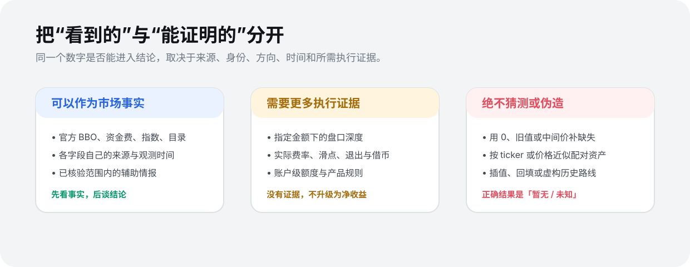

# 数据原则

  

51taoli 的核心不是“把数字放得多”，而是让每个可见结论能追溯到正确的事实边界。

## 1. 只展示可验证来源

市场事实优先来自交易所官方公开接口。平台若使用自有只读凭证补充公开能力不足的数据，只能使用最小权限、平台自有、受控的只读凭证；不使用用户账户、交易权限、划转权限或提现权限。

## 2. 不同事实有不同时间

报价、资金费、标记价、指数价、公告、充提和借贷都可能以不同节奏更新。一个字段更新，不能把其他字段的时间一并刷新。

页面的“实时”只表示当时读取到的有效市场事实，不应掩盖单个字段过期、缺失或时钟不一致的情况。

## 3. 资产身份不能靠名称猜测

同名 ticker、相近价格或相同计价币都不足以证明跨所资产等价。加密资产需要规范网络、合约地址或可靠的原生链身份；TradFi 产品还需要发行人、正式代码、单位和公司行动等证据。

已确认的错误配对必须移除；证据不足时不应把路线升级为可执行结论。

## 4. 缺失时不造数据

生产页面不使用以下方式制造完整感：

- 模拟行情或虚构套利路线；
- 用 `0` 代替未知值；
- 用中间价、标记价或旧值代替缺失的买一/卖一；
- 插值、前值延续或回填未采集的历史；
- 从相邻字段反推出来源没有提供的事实。

正确行为是保留「暂无」、断点、来源状态或具体不可用原因。

## 5. 覆盖范围必须如实表述

当前七所是只读行情范围，不是“七所全部交易对”或“所有市场能力”。不同市场、产品、数据族和时间段的覆盖独立变化。公告、充提、借贷等辅助情报仅在各自官方能力已验证时展示。

## 6. 文档不是生产证明

本仓库解释产品规则和术语。某项功能是否在某一时刻可用，需要分别以实际接口、数据来源状态、网页展示和生产验证结果确认。
