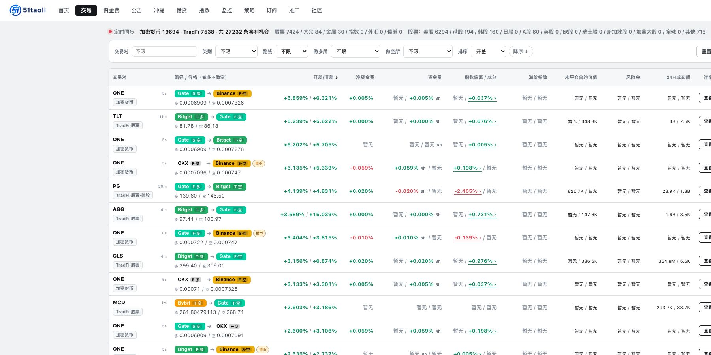

# 界面导览

[**打开官网查看当前页面 →**](https://51taoli.com/opportunities)

下面的截图只解释页面结构，实时资产、数值和状态以官网为准。

## 1. 机会总览：先选资产和路线

- 用「全部 / 加密货币 / TradFi」切换市场类别；
- 用 `FF / SF / FS / SS / TF / FT / TT` 选择路线；
- 左侧先看资产摘要，右侧再看同一资产下的具体方向；
- 每条路线从左往右读：做多腿 → 做空腿 → 开差。

## 2. 交易看板：把路线与证据放在一行

这里适合做横向比较：

- 交易对、市场类别和路线；
- 做多所与做空所；
- 两条腿的方向性报价；
- 开差、清差与净资金费；
- 指数偏离、未平仓合约价值、风险金和成交额等辅助字段。

「暂无」表示当前没有可靠数据，不是 0。

## 3. 策略目录：先看状态，再看规则

- 左侧按编号、类型和状态找策略；
- 右侧查看规则、阈值、真实样本和当前机会；
- 「已开放」表示可以订阅；
- 「验证中」表示仍在积累真实样本；
- 「开发中」表示规则尚未开放。

策略页面没有样本时会明确显示「暂无」或「真实历史样本不足」。

## 4. 接下来去哪里

- 不熟悉路线代码：[核心概念](CONCEPTS.md)
- 想按步骤判断一条路线：[使用路径](USE-51TAOLI.md)
- 想设置提醒：[监控与策略](MONITORING-AND-STRATEGIES.md)
- 页面或数据有问题：[提交反馈](https://github.com/yangshu2087/51taoli/issues/new/choose)
