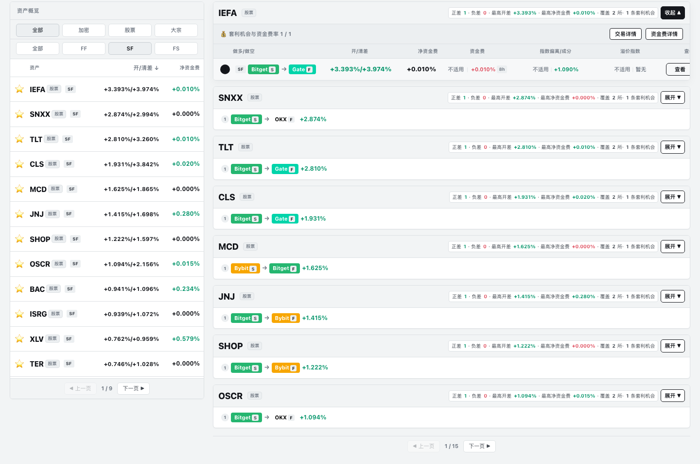
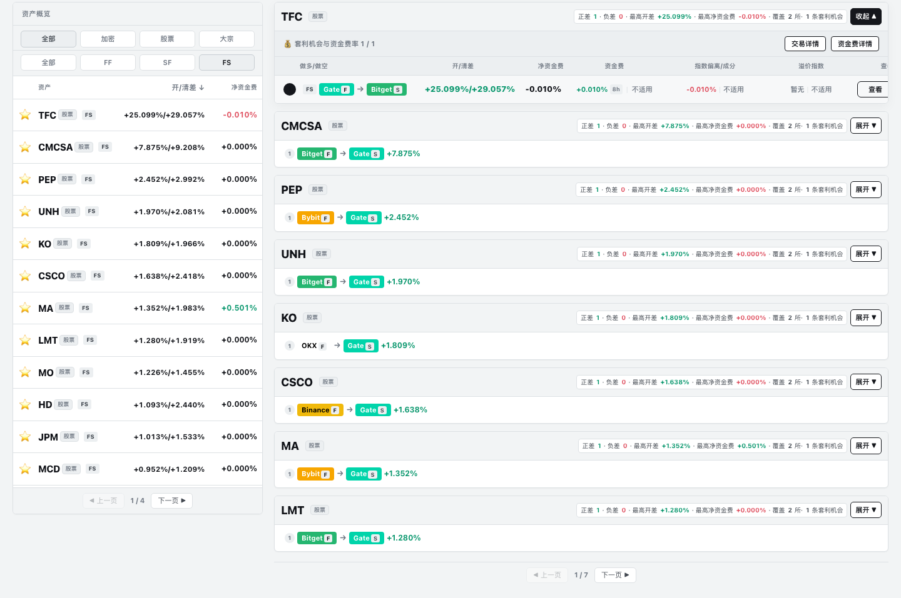

# 界面怎么读

[**打开官网，查看当前页面 →**](https://51taoli.com/opportunities)

下面用实际界面示例说明各区域承担的任务；实时数值以官网为准。

## 1. 先从机会列表开始

- 左侧：按资产、市场类别和 FF / SF / FS 路线筛选；
- 右侧：先看到资产，再展开查看具体路线；
- 每条路线都从“多哪边、空哪边”开始读。

## 2. 展开 SF 路线，查看现货多与期货空

SF 表示现货多、合约 / 永续空。展开后重点查看两条腿、开差、清差和资金费字段，再决定是否进入交易或资金费页面继续研究。

## 3. 展开 FS 路线，查看期货多与现货空

FS 表示合约 / 永续多、现货空。除报价和资金费外，还可以按需要进入借贷页面了解相关条件。

## 接下来去哪里

- 想按条件找更多路线：[交易页面](https://51taoli.com/trade)；
- 想看资金费与结算周期：[资金费页面](https://51taoli.com/opportunities?tab=funding)；
- 想进一步理解术语：[核心概念](CONCEPTS.md)；
- 遇到问题：[官方社群](https://t.me/taoli51)。
