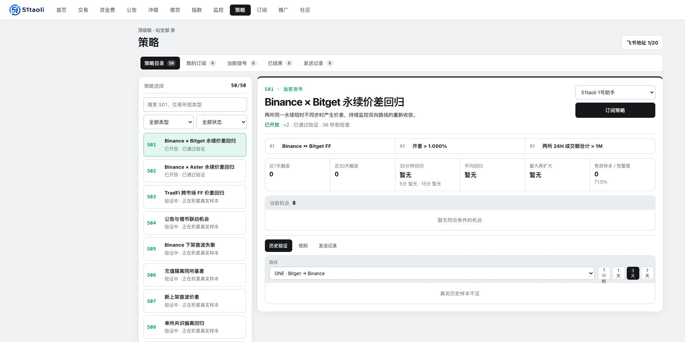

# 监控与策略

[**打开监控中心 →**](https://51taoli.com/monitor)　[**浏览策略目录 →**](https://51taoli.com/playbook)

## 监控是什么

监控用于盯住一个明确对象、路线或条件。当前页面按固定顺序提供七类监控：

1. 套利开差
2. 资金费率
3. 公告
4. 充提
5. 借贷
6. 指数
7. 双币种比率

监控会保留提醒、启用状态、需要处理和发送失败等信息。创建数量和通知地址额度取决于当前订阅版本。

## 策略是什么

策略是一套可以解释和复核的筛选规则。当前目录为 S01–S50，按主题分为：

| 编号 | 主题 |
| --- | --- |
| S01–S08 | 已有核心策略与跨市场异常 |
| S09–S17 | 衍生品与衍生品（FF） |
| S18–S24 | 期现、现货和多路径定价 |
| S25–S32 | 资金费率 |
| S33–S39 | 公告、上 / 下架与充提 |
| S40–S46 | 指数、双币种和相对价值 |
| S47–S50 | TradFi/RWA 路线 |

当前 S01、S02 已开放；S44–S46 显示开发中；其他策略显示验证中。状态会随真实样本和产品发布变化，以官网为准。

## 三种状态怎么理解

- **已开放**：规则已通过当前验证，可按账户额度订阅；
- **验证中**：规则已进入真实样本积累阶段，但还未开放；
- **开发中**：规则或页面仍在建设，不应当成可用信号。

没有真实样本时，页面会显示「暂无」或「真实历史样本不足」，不会补造表现数字。

## 通知发送到哪里

当前策略与监控通知使用账户中配置的飞书地址。Telegram 官方小助手负责社群答疑、命令帮助和公告入口，不应被当作交易执行器。

## 订阅版本

免费版可以查看基础行情和策略目录，但不能创建监控或订阅策略。付费版本提供全部页面和不同的监控、策略、飞书地址额度；价格、支付状态和当前权益以 [订阅页面](https://51taoli.com/subscription) 为准。
