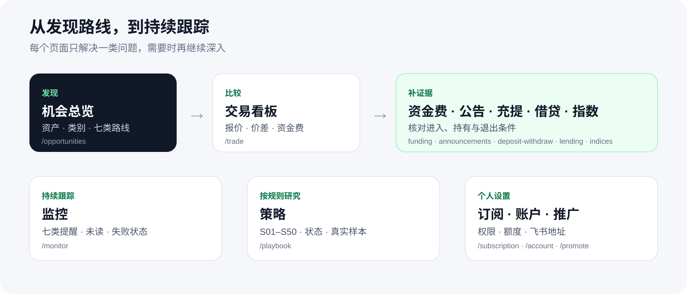

# 打开官网后，哪里找什么

  

[**从“套利机会”开始 →**](https://51taoli.com/opportunities)　[**看真实历史界面截图 →**](SCREENSHOTS.md)

| 页面 | 你在这里解决什么问题 | 别忽略的边界 |
| --- | --- | --- |
| **套利机会** `/opportunities` | 现在有哪些 FF / SF / FS 的方向性跨市场观察？ | 正开差不是可执行利润；真实空状态不填假数据。 |
| **交易** `/trade` | 怎么按资产、TradFi 分类、路线和交易所筛选？ | TradFi 产品目录与理论路线分开；同 ticker 不自动合并。 |
| **资金费** | 原始费率、原始周期和已结算记录是什么？ | 不把不同周期硬变成同一交易所事实；估算不等于预测。 |
| **指数** `/indices` | 同币种跨所或双币种的指数、标记价、资金费如何比较？ | 当前快照和闭合历史分开；缺失点不插值、不跨空值连线。 |
| **公告** `/announcements` | 有哪些可验证的官方公告或市场状态？ | 市场状态不冒充公告原文；没有来源不编一条。 |
| **冲提** `/deposit-withdraw` | 某资产在某交易所/网络的充值、提现状态如何？ | 状态、费用、限额与时间来自同一 canonical 事实。 |
| **借贷** `/lending` | 借入/出借利率、额度和适用范围是什么？ | 公共数据不是“你一定能借到的额度”；缺失不填 0。 |
| **策略** `/playbook` | 精选策略的状态、版本、规则和当前真实机会是什么？ | 路线类型不等于策略；观察中的策略不当成已开放订阅。 |
| **账户 / 订阅** | 我的权限、授权记录、策略订阅和通知渠道是什么？ | 登录不是交易所授权；页面权限和 API 权限应一致。 |

## 看页面时的共同规则

- **同一事实，别在不同页面变了口径**：记录、单位、时间和来源状态要保持一致；
- **手机不能把关键未知藏掉**：桌面适合高密度表格，手机可以用卡片，但风险和空状态不能消失；
- **数据状态比“看上去完整”重要**：来源不可用或条件不满足时，就明确留空。
