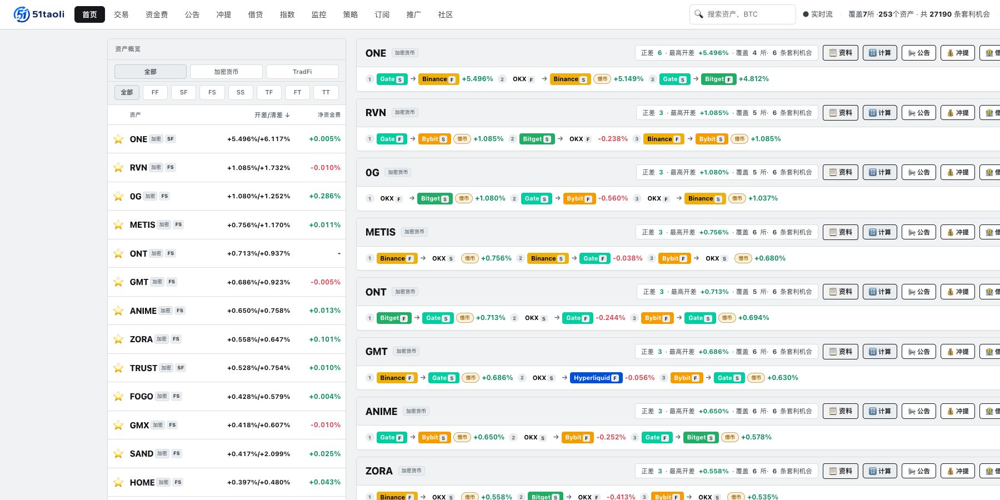

# 产品介绍

[**打开 51taoli 官网 →**](https://51taoli.com/opportunities)

51taoli 是一个**只读的全市场套利信息平台**。它把不同交易所、不同市场类型里的报价和相关证据整理到一条路线中，方便你先发现差异，再判断这条差异是否值得继续研究。

## 它解决什么问题

跨市场研究最麻烦的往往不是“看到两个价格”，而是把下面这些问题同时说清楚：

- 两条腿是不是同一个或可比的产品；
- 做多腿应该看哪个 `ask`，做空腿应该看哪个 `bid`；
- 资金费、深度、滑点、借贷和充提是否支持这条路线；
- 报价与辅助信息是否足够新；
- 退出时会遇到什么条件。

51taoli 把这些信息分层展示，缺少证据时保留「暂无」，而不是补一个看起来完整的数字。

## 当前产品组成

| 模块 | 用途 |
| --- | --- |
| 机会总览 | 按资产、加密货币 / TradFi 和七类路线快速发现对象 |
| 交易看板 | 比较两条腿的报价、开差、清差、资金费和辅助字段 |
| 资金费 | 核对原始费率、结算周期和相关记录 |
| 公告、充提、借贷 | 补充影响进入、持有和退出的市场事实 |
| 指数 | 查看指数、标记价、历史区间和双币种相对关系 |
| 监控 | 对套利开差、资金费率、公告、充提、借贷、指数和双币种比率设置提醒 |
| 策略 | 浏览 S01–S50 的规则、状态和真实样本 |
| 订阅与账户 | 管理页面权限、监控 / 策略额度和飞书通知地址 |

> 截图中的资产、报价、数量和状态只用于说明界面结构，以官网当前结果为准。

## 当前市场范围

只读行情来源包括：

- Binance
- OKX
- Bybit
- Bitget
- Gate
- Hyperliquid
- Aster

路线覆盖 `FF`、`SF`、`FS`、`SS`、`TF`、`FT`、`TT`。交易所名单不等于每个交易所的全部交易对、产品类型和辅助字段都已覆盖。

## 适合怎样使用

51taoli 适合需要把跨市场信息放在一起核对的人：

- 比较不同交易所的同类现货或衍生品；
- 研究加密货币现货与衍生品的基差；
- 比较 TradFi/RWA 产品与加密衍生品或另一 TradFi 产品；
- 用公告、充提、借贷、指数等事实解释价差；
- 把明确条件变成监控或策略订阅。

## 产品边界

51taoli 当前不替用户：

- 下单或自动交易；
- 连接交易所账户执行操作；
- 划转、充值、提现或管理资产；
- 把理论价差解释为确定收益。

登录是 51taoli 自己的账户与权限识别，不是交易所授权。

## 下一步

- 第一次使用：[怎样读一条路线](USE-51TAOLI.md)
- 不熟悉字母和公式：[核心概念](CONCEPTS.md)
- 想知道每个页面的用途：[产品页面地图](PRODUCT-MAP.md)
- 想讨论具体问题：[官方社群](https://t.me/taoli51)
