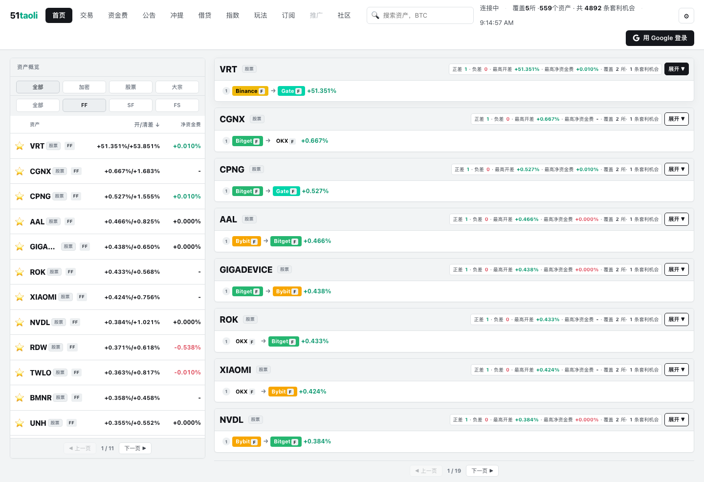
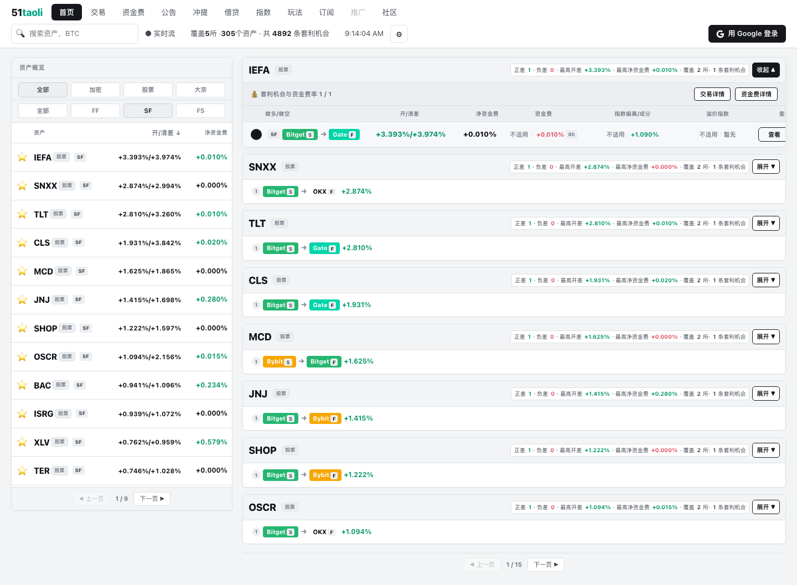
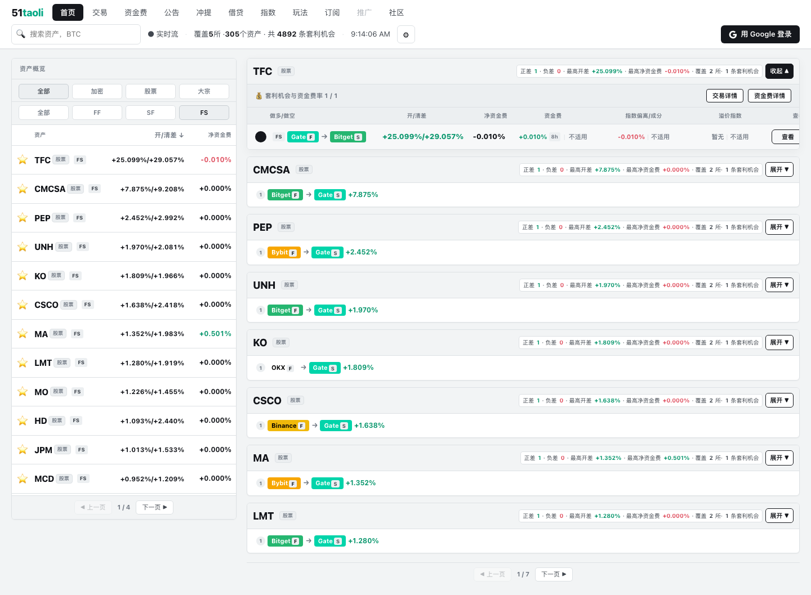

# 界面截图与阅读方式

> 想看现在的状态，不要把截图当实时页面：[**打开官网“套利机会” →**](https://51taoli.com/opportunities)

这些图片是已保留的**生产页面历史截图**，不是设计稿、演示数据或当前交易信号。它们拍摄于 **2026-08-17**：当时页面顶部显示覆盖 5 所，画面中的行情、数量、时间和覆盖范围都只代表拍摄那一刻。当前公开范围为七所只读行情，但实时覆盖与来源状态必须以官网当时页面为准。

## FF：合约 / 永续对合约 / 永续

你会先看到资产和路线筛选，再看到某个资产下的方向性路线。要点不是绿色百分比，而是：做多/做空的两条腿是谁、箭头方向是否清楚、展开后有没有足够的证据继续判断。

## SF：现货多、合约 / 永续空

SF 多了一层现货和合约之间的比较。除路线方向外，还要看合约规格、资金费和实际费用。图中展开的详情告诉你该去哪里找字段，并不代表这条路线在今天仍可执行。

## FS：合约 / 永续多、现货空

FS 除了报价和资金费，还离不开真实的借币利率、额度和适用范围。少了这些，看到正开差也不能跳到净收益结论。

## 读截图和读实时页面，共用这三个问题

1. 多腿在哪，空腿在哪？做多看 `ask`、做空看 `bid` 吗？
2. 两边的产品和资产身份真的可比吗？
3. 深度、实际费用、退出、借贷、额度等关键证据有没有缺失？

一项关键证据缺失时，「暂无」就是正确状态。想进一步了解术语，读 [核心概念](CONCEPTS.md)；需要问具体页面或数据，去 [官方社群](https://t.me/taoli51) 或联系 [@taoli51_bot](https://t.me/taoli51_bot)。
